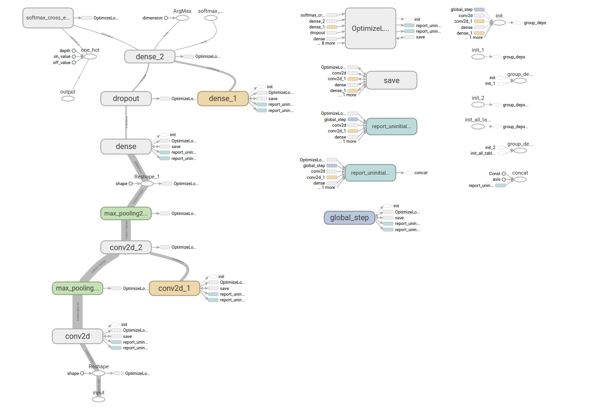

# Project Pepe Server

Most of the server is hosted on [Heroku](https://project-pepe-imgs.herokuapp.com), with
the exception of the `meme_learning` directory. With the exception of that
directory, this project acts as a file server, and an API endpoint for the
**Life is a Meme** app (otherwise known as [Project
Pepe](https://github.com/elc1798/project-pepe). All of that is done in Flask,
and is fairly simple.

(The `meme_learning` directory isn't on heroku, since the model itself is 4.2 GB
and has to be loaded into live memory. I doubt the Heroku free plan will let me
do that...)

# The Meme Learning Directory

This was an extension on the Life is a Meme Android app that I wrote for CS
126 at UIUC. I figured that it would be fun to try to learn some TensorFlow and
Deep Learning, so I tried to write a network to rate the dankness of memes (must
be in image form, sorry, no video memes!)

The data that I used was pulled from the UIUC Memes for Underfunded Teens
Facebook group using the Facebook Graph API, and the ratings were done by my
friend Kyle Begovich at around 1 a.m. while procrastinating on projects, so
expect the pre-trained model to be heavily skewed towards his tastes. (Yes, I
was going to use likes and shares to determine ratings, but I didn't have enough
time to sift through the FB Graph API enough to figure out how to do that.)

To get the pre-compiled model, extract
[this](https://drive.google.com/open?id=0Bzfaqx5HvQk4Z0IxQXpvREVBZUk) TARball
archive and put its contents into the `meme_learning/models/` directory. From
there, you should be able to run `trainer.py` to check if it's working properly.

To train your own model, populate the `meme_learning/data/` directory with
images, with filenames in the following format:
`rating_xx_UNIQUE_FILE_ID.extension`. I haven't tested any image files that
weren't `.png` or `.jpg` formats, so  `¯\_(ツ)_/¯`.

After populating the model, run `trainer.py`. It should do the crunching for
you. If not and there's an error, submit a fix and send a PR, or submit an
issue!

## The Meme Rating Model

(Keep in mind I have very limited experience with Deep Learning... This model
might be extremely inefficient, or completely wrong. I'd appreciate feedback in
the issues though!)

First, we take the image and resize to 299x299, since we may have some extremely
large resolution images. We then run the image through the Inception Imagenet
Network to pull the 3 (it's probably better to use more, but this was just for
testing) objects from the image.

We then construct our input matrix:

```
    [ Red Channel ]
    - Zero Padding -
    [ Blue Channel]
    - Zero Padding -
    [ Green Channel]
    - Zero Padding -
    [ One-hot encoded detected objects]
```

The `y` vector is the ratings, a vec of `int32`s ranging from 1 to 10. This
input matrix is fed into a convolutional network, described in more detail at
the top of the `trainer.py` file.

## TensorBoard Render



